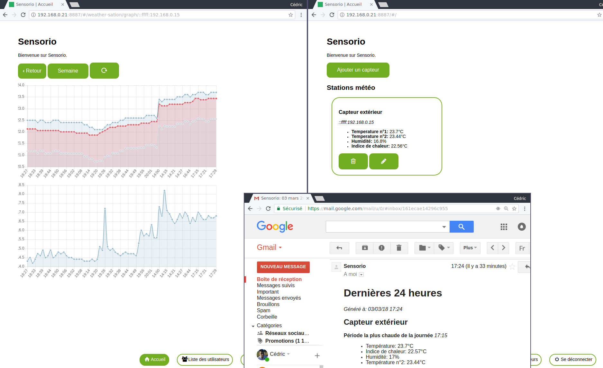

# sensorio-hub
A hub to manage many sensor and their data.

To get the address ip to identify the sensor you can do a request to **`/ip`**.

To code the front javascript, you have to use: `npm run code`, it will start a browser-sync server.



## Configuration

You will have to create a `.env` file to configurate the mail service:
```dosini
MAIL_LANGUAGE=en
MAIL_SERVICE=gmail
MAIL_AUTH_USER=example@gmail.com
MAIL_AUTH_PASS=password
```
You can use a lot of service as described [there](http://nodemailer.com/smtp/well-known/).
I use another GMail account to send me the data each day.

## API

In this software, there are API for users, weather data, version, and also to force tasks.

### weather data

* POST `/api/weather-data/` publish weather data (accept only request from sensors)
* GET `/api/weather-data/:ip` get all weather data from a specific sensor (authentication required)
* GET `/api/weather-data/:ip/week` get all weather data from a specific sensor for the last 7 days (authentication required)
* GET `/api/weather-data/:ip/day` get all weather data from a specific sensor for the last 24 hours (authentication required)
* GET `/api/weather-data/:ip/displayer` get to the last value of a weather sensor 